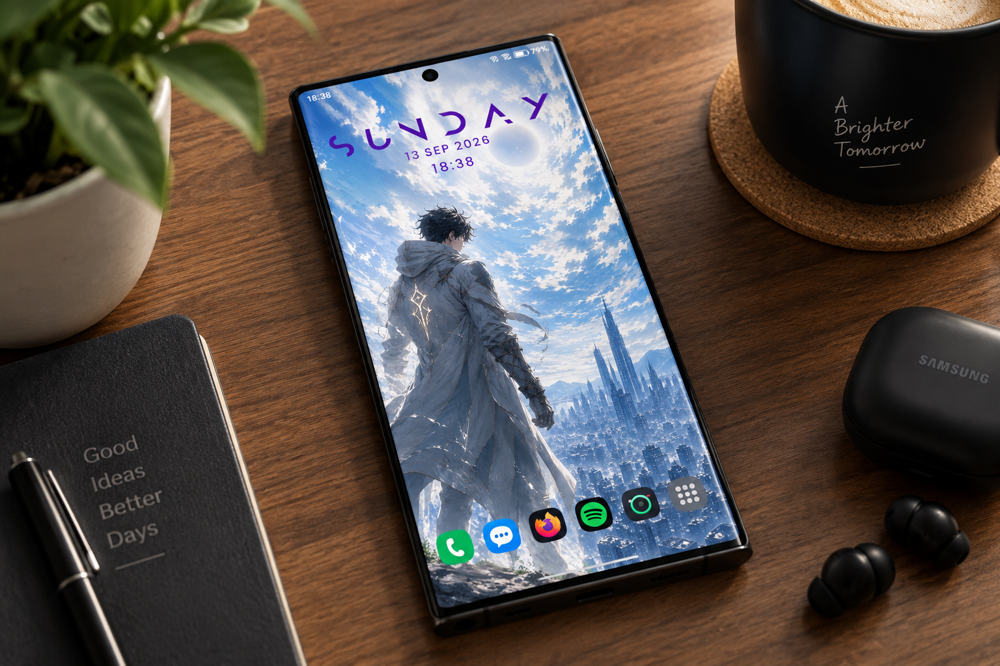
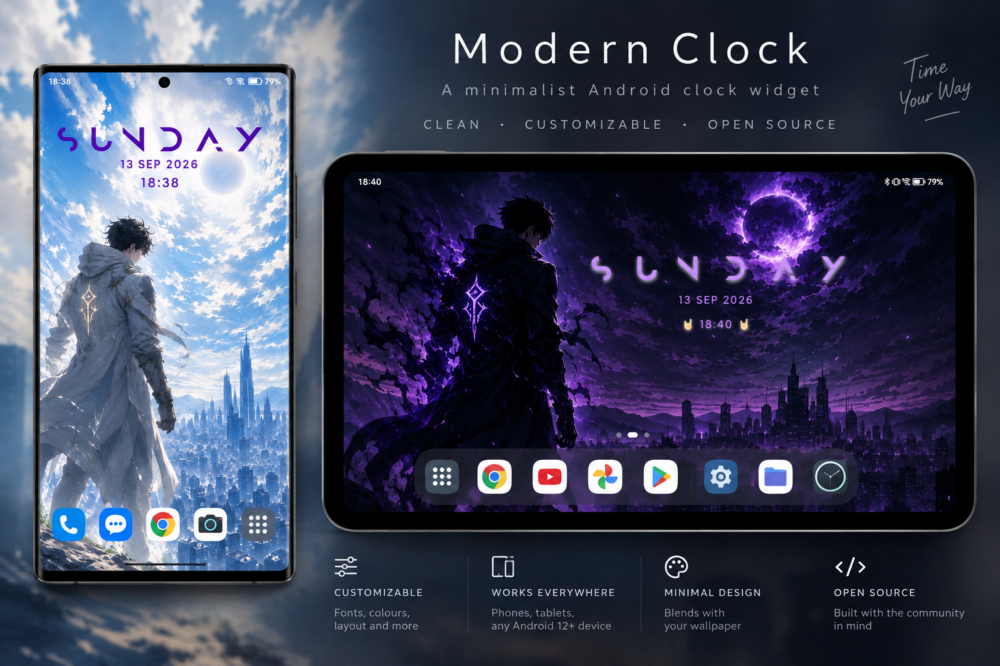
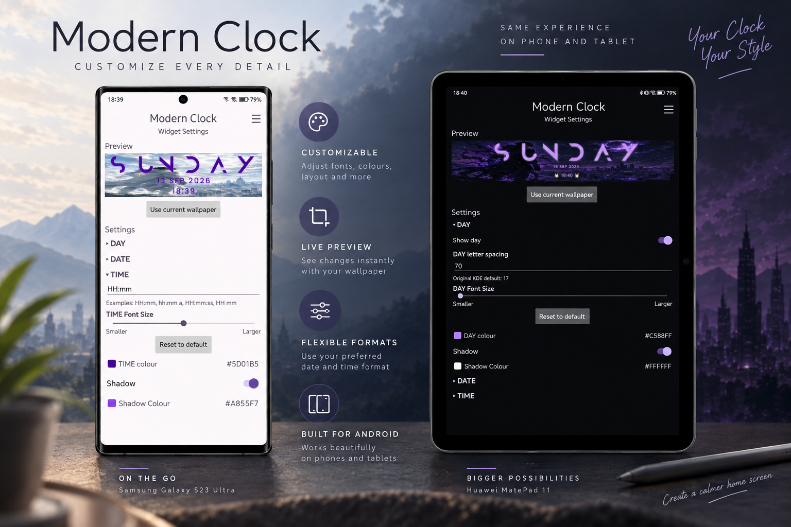

# Modern Clock

> A minimalist, customizable Android home-screen clock widget inspired by KDE Modern Clock.

<div style="text-align: center">
  <a href="https://github.com/Dark-Witcher/modern-clock-android/releases">
    
  </a>
  <a href="https://github.com/Dark-Witcher/modern-clock-android/blob/main/LICENSE">
    
  </a>
  <a href="https://github.com/Dark-Witcher/modern-clock-android">
    
  </a>
</div>

<div style="text-align: center">
  
</div>

Modern Clock brings the distinctive KDE Modern Clock aesthetic to Android as a native home-screen widget.

It is deliberately simple: a stylized day, date, and time — with enough control to make it fit your wallpaper and your setup without turning the clock into a customization suite.

## ✨ Features

- 🕐 Minimalist Android home-screen clock widget
- 🔤 Stylized day display using the Anurati typeface
- 📅 Customizable date format
- ⏱️ Customizable time format
- 🎨 Independent colors for day, date, and time
- ↔️ Adjustable day letter spacing
- 🔠 Adjustable font sizing
- 👁️ Option to show or hide the day
- 🌑 Subtle text shadows for readability over wallpapers
- 🖤 True-black OLED mode
- 🌗 Light, dark, and system appearance settings
- 📐 Resizable Android widget
- ⚡ Automatic clock updates
- 📱 No Google Play Services required


## 📱 Screenshots

### Home Screen

Modern Clock is designed to work naturally with your existing home screen and wallpaper.

<div style="text-align: center">
  
</div>

### Customization

Configure the widget directly from the app, with a live preview of your changes.

<div style="text-align: center">
  
</div>

---

The settings screen gives you control over typography, spacing, formats, colors, shadows, and visibility.

## 🎨 Design

Modern Clock is inspired by the KDE Modern Clock Plasma widget, which itself takes inspiration from the Rainmeter Mond skin.

The Android version preserves the distinctive minimalist appearance while adapting it to Android's home-screen widget system.

The day uses **Anurati**, while the date and time use **Poppins**, following the visual approach of the original project.

## 📦 Installation

1. Go to the [Releases](https://github.com/Dark-Witcher/modern-clock-android/releases) page.
2. Download the latest `Modern Clock-vX.X.apk`.
3. Install the APK on your Android device.
4. Open Modern Clock once after installation.
5. Add Modern Clock from your home-screen widget picker.
6. Configure the widget to your liking.

Android may ask you to allow installation from the source you used to download the APK.

### Compatibility

- **Minimum Android version:** Android 12 (API 31)
- **Google Play Services:** Not required
- Requires an Android-compatible launcher with support for third-party home-screen widgets.

### Tested devices

Modern Clock has been tested on:

- Samsung Galaxy S9+ — Android 14 / One UI 6
- Samsung Galaxy S23 Ultra - Android 16 / One UI 8.5
- Huawei MatePad 11 — HarmonyOS 3
- Google Pixel 10 Pro - Android 17

## ⚙️ Configuration

Modern Clock provides independent controls for the main elements of the widget.

### Day

- Show or hide the day
- Adjust letter spacing
- Adjust font size
- Choose the day color
- Enable or disable a text shadow
- Choose the shadow color

### Date

- Set a custom date format
- Adjust font size
- Choose the date color
- Configure shadow settings

Examples:

```text
dd MMM yyyy
dd MMMM yyyy
MMM dd yyyy
yyyy-MM-dd
```

### Time

- Set a custom time format
- Adjust font size
- Choose the time color
- Configure shadow settings

Examples:

```text
HH:mm
hh:mm a
HH:mm:ss
HH mm
```

### Colors

Each element can be configured independently using the built-in color picker.

HEX values can be entered directly, with RGB and HSL representations available in the picker.

### Appearance and OLED mode

The app supports:

- Same as device
- Light
- Dark
- True-black background for OLED displays

## 🛠️ Building from Source

### Requirements

- Android Studio
- Android SDK with API 31 or newer
- JDK compatible with the Android Gradle Plugin used by the project

Clone the repository:

```bash
git clone https://github.com/Dark-Witcher/modern-clock-android.git
cd modern-clock-android
```

Open the project in Android Studio and allow Gradle to synchronize.

Build a debug APK:

```bash
./gradlew assembleDebug
```

The APK will be generated under:

```text
app/build/outputs/apk/debug/
```

To create a release APK, use:

**Android Studio → Build → Generate Signed App Bundle / APK**

A release build must be signed with your own keystore.

> Never commit your signing keystore or its passwords to Git.

## 🚧 Current release

**v1.1 — Stable**

Version 1.1 expands the original release with additional customization and typography controls while keeping the interface focused.

See the [Releases](https://github.com/Dark-Witcher/modern-clock-android/releases) page for the latest build.

## 🗺️ Roadmap

### v1.2

Development is focused on further refining widget sizing, typography relationships, spacing, and rendering across different screen sizes and device configurations.

The project intentionally keeps the interface focused rather than turning the widget into an overly complicated customization tool.

## 🙏 Attribution

Modern Clock is based on the visual concept and design of **KDE Modern Clock by Prayag2**:

https://github.com/Prayag2/kde_modernclock

The original KDE Modern Clock project is licensed under GPL-3.0.

This Android port is also released under GPL-3.0.

Created by **Dark Witcher**:

https://github.com/Dark-Witcher

## 📄 License

Modern Clock is free and open-source software licensed under the **GNU General Public License v3.0**.

See [`LICENSE`](LICENSE) for the complete license text.

---

<div style="text-align: center"> **Simple. Minimal. Always visible.** </div>
